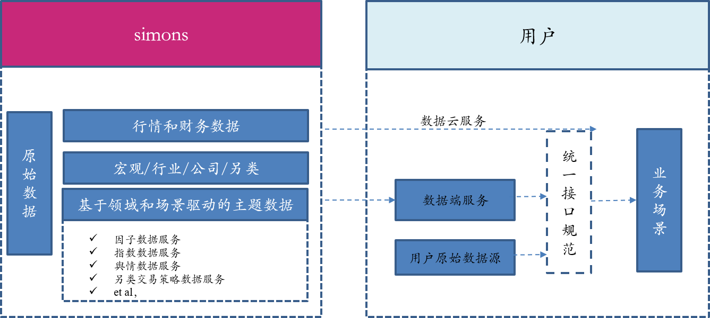

.. simons documentation master file, created by
   sphinx-quickstart on Sat Jul 11 14:22:22 2020.
   You can adapt this file completely to your liking, but it should at least
   contain the root `toctree` directive.

=======================================================
simons's Documentation
=======================================================

simons是一个金融数据工具包，提供一套跨品种通用API，为量化投资者/学术研究人员/投资公司/金融科技公司获取金融资产的历史数据和实时行情数据提供服务, 
满足用户投资研究和实时交易的数据层面的需求

.. note::

    simons目前处于活跃开发状态(alpha版本)，API接口设计和文档会时常变化

feature
============================

simons计划提供的日更新数据包括

===============================   ============================================================   =====================
标的类型                           历史数据                                                       实时行情数据
===============================   ============================================================   =====================
股票                               基本信息，日频/分钟/tick交易数据，股票财务数据及衍生            分钟/tick交易数据
指数                               基本信息，成分/权重, 日频交易数据                               分钟/tick交易数据
场内基金                           基本信息，日频数据
中国期货（股指/国债/商品期货)      基本信息，日频/分钟/tick数据                                   分钟/tick交易数据
可转债                             基本信息，日频/分钟/tick数据                                    分钟/tick交易数据
因子数据                           基本信息，日频/分钟/tick数据                                    分钟/tick交易数据
宏观/行业/另类数据                 基本信息， 日频/周/季频
===============================   ============================================================   =====================

Philosophy
============================
simons的设计哲学主要关注在统一性

* 研究环境和交易环境使用数据接口的统一性
* 跨品种数据的统一性
* 默认数据源和第三方数据源接口设计和转换的统一性

.. toctree::
    :caption: basics
    :hidden:
    
    intro/overview
    intro/install

.. toctree::
    :caption: API
    :hidden:
    
    api/trading_data_api
    api/instrument_api
    api/financial_data_api
    api/quantitative_factor_api

.. toctree::
   :caption: 数据字典
   :hidden:
   
   data_dictionary/stock
   data_dictionary/index
   data_dictionary/industry_and_conception
   data_dictionary/fund
   data_dictionary/bond
   data_dictionary/macroeconomic
   data_dictionary/quantitative_factor
   